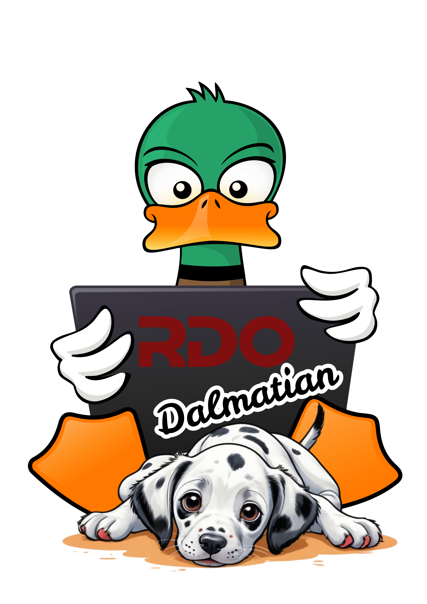

# Community

Help us make the RDO community site a great place for users and cloud operators in the Red Hat ecosystem. There are many ways to contribute to RDO, some of which are detailed below.

Our community strives to operate according to the terms of the
[OpenStack Code of Conduct](https://www.openstack.org/legal/community-code-of-conduct/).

If you're just getting started, and are looking for a little help,
consult our [mentors list](../contribute/mentors.html.md).

## People person

* [Join the RDO mailing lists](mailing-lists.md)
* Chat on #rdo on OFTC
* [Participate in weekly meetings](community-meeting.md)

## Latest RDO activity

### RDO Dalmatian 2024.2 released!

The RDO community is pleased to announce the general availability of the RDO build for OpenStack 2024.2 Dalmatian! Dalmatian is the 30th release from the OpenStack project, which is the work of more than 1,000 contributors from around the world.

The release is already available for CentOS Stream 9 on the CentOS mirror network in:

[https://mirror.stream.centos.org/SIGs/9-stream/cloud/x86_64/openstack-dalmatian/](https://mirror.stream.centos.org/SIGs/9-stream/cloud/x86_64/openstack-dalmatian/)

The highlights of the broader upstream OpenStack project may be read via [https://releases.openstack.org/dalmatian/highlights.html](https://releases.openstack.org/dalmatian/highlights.html).

OpenStack Dalmatian is not marked as Skip Level Upgrade Release Process or SLURP. According to [this model](https://governance.openstack.org/tc/resolutions/20220210-release-cadence-adjustment.html) this means that upgrades will only be supported from the Caracal 2024.1 release to the next SLURP release (i.e Epoxy).

RDO Dalmatian 2024.2 has been built and tested with the recently released [Ceph 18.2.0 Reef version](https://docs.ceph.com/en/latest/releases/reef/) which has been published by the CentOS Storage SIG in the official CentOS repositories.

#### Retired projects
 During the Dalmatian cycle, some projects have been retired or declared inactive upstream. As such, the following packages for some projects are not present in the RDO Dalmatian 2024.2 release:

* [python-saharaclient](https://review.rdoproject.org/r/c/rdoinfo/+/54360)
* [puppet-corosync](https://review.rdoproject.org/r/c/rdoinfo/+/53127)

#### Contributors

During the Dalmatian cycle, we saw the following new RDO contributors:

* Roman Safronov
* Archana Singh
* pkomarov komarov
* Sergii Golovatiuk
* Milana Levy
* Liron Kuchlani
* Jaromír Wysoglad
* Arnau Verdaguer
* Andre Aranha

Welcome to all of you and Thank You So Much for participating!

But we wouldn't want to overlook anyone. A super massive Thank You to all 51 contributors who participated in producing this release. This list includes commits to rdo-packages, rdo-infra, and rdo-website repositories:

* Alfredo Moralejo Alonso
* Amy Marrich
* Ananya Banerjee
* Andre Aranha
* Archana Singh
* Arnau Verdaguer
* Artom Lifshitz
* Arx Cruz
* Bhagyashri Shewale
* Bohdan Dobrelia
* Cédric Jeanneret
* Chandan Kumar
* Daniel Pawlik
* Douglas Viroel
* Fabien Boucher
* Fiorella Yanac
* Francesco Pantano
* Goutham Pacha Ravi
* Gregory Thiemonge
* Grzegorz Grasza
* Harald Jensås
* Jaromír Wysoglad
* Joan Francesc Gilabert
* Joel Capitao
* Jon Schlueter
* Karolina Kula
* Karthik Sundaravel
* Lewis Denny
* Liron Kuchlani
* Lon Hohberger
* Luigi Toscano
* Maor Blaustein
* Marihan Girgis
* Marios Andreou
* Martin Kopec
* Martin Magr
* Michael Johnson
* Milana Levy
* Nicolas Hicher
* Pini Komarov
* Roman Safronov
* Ronelle Landy
* Sergii Golovatiuk
* Shreshtha Joshi
* Soniya Vyas
* Steve Baker
* Takashi Kajinami
* Tobias Urdin
* Tristan De Cacqueray
* Yadnesh Kulkarni
* Yatin Karel

#### The Next Release Cycle

At the end of one release, focus shifts immediately to the next release i.e Epoxy.

### Centos Connect, Brussels, 2024

<iframe width="630" src="https://www.youtube.com/embed/LocoEPmbL4U" title="OpenStack RDO deployment on Community Distribution of Kubernetes (OKD)" frameborder="0" allow="accelerometer; autoplay; clipboard-write; encrypted-media; gyroscope; picture-in-picture; web-share" referrerpolicy="strict-origin-when-cross-origin" allowfullscreen></iframe>

### Centos Connect, Brussels, 2023

<iframe width="630" src="https://www.youtube.com/embed/jaoIph_mEqM" title="From code to cloud - the journey of Openstack package" frameborder="0" allow="accelerometer; autoplay; clipboard-write; encrypted-media; gyroscope; picture-in-picture; web-share" referrerpolicy="strict-origin-when-cross-origin" allowfullscreen></iframe>

See more at dedicated [page](rdo-videos.md).

## User

* Share questions and solutions on [openstack mailing lists](https://lists.openstack.org/mailman3/lists/)
* Add [the most useful solutions](../misc/troubleshoot.md)

## Discuss

### IRC channels

Come chat in real-time with RDO users on **IRC** on the [OFTC](http://oftc.net) server:

* **#rdo**: Any general conversation about RDO, including developer issues and user questions. ([Transcripts.](http://eavesdrop.openstack.org/irclogs/%23rdo/))

* **#openstack**: Remember that RDO is just a small part of a larger community. Questions about OpenStack in general, not specifically about RDO, should go to the upstream channel. ([Transcripts.](http://eavesdrop.openstack.org/irclogs/%23openstack/))

Come chat in real-time with the CentOS Cloud SIG  on **IRC** on the [Libera Chat](http://libera.chat) server:

* **#centos-cloud**: If you have questions about the CentOS [Cloud Special Interest Group (SIG)](https://sigs.centos.org/cloud/) and the parts of the RDO infrastructure that run in the CentOS Community Build System (cbs), this is where you're most likely to get answers.
* **#centos-devel**: If you have questions about the CentOS Project

### IRC meetings

We have weekly IRC meetings you can participate in:

* [RDO meetings @ every Wednesday at 14:00 UTC on #rdo on OFTC](community-meeting.md)
* [CentOS Cloud SIG meetings on the second Thursday of the month at 15:00 UTC on #centos-meeting on Libera Chat](https://sigs.centos.org/cloud/communication/meetings/)

## Content writer

All contributions are welcome, so if you would like to contribute to this page or propose change, there are two options for that:

* [Propose change by Gerrrit](https://review.rdoproject.org/r/q/project:rdo-infra%252Frdo-mkdocs-website)
* [Create RDO Jira issue](https://issues.redhat.com/projects/RDO/issues) (selecting "documentation" component during creation), if you are not familiar with this workflow, however, you can find instructions in our [onboarding](https://www.rdoproject.org/contribute/onboarding/).

## Additional sources

- Check our [Frequently Asked Questions (FAQ) page](faq.md) for answers to common questions
- Try our [troubleshooting page](../misc/troubleshoot.md) for solutions to common problems
- Watch [RDO videos](rdo-videos.md). These include recorded talks and community events.
- Help improve our knowledge base by turning the best answers to questions on the [mailing lists](mailing-lists.md).
- [Fork the website on Github](https://github.com/redhat-openstack/website) and help us improve our documentation.
